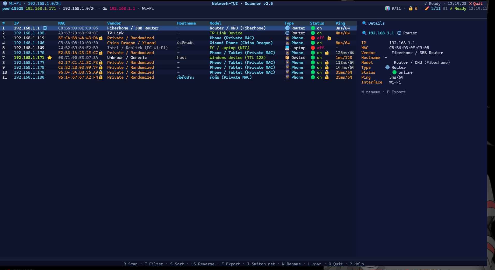
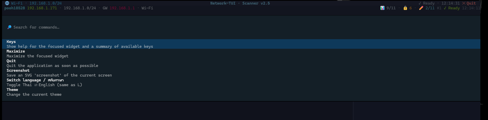

# 🌐 Network-TUI

> [English](README.md) | ไทย

**ตัวสแกนเครือข่ายแบบ TUI — เห็นทั้งผู้ใช้งาน • อุปกรณ์ • ชื่อรุ่น**


> สแกนเครือข่าย Wi-Fi / LAN แล้วแสดงตารางอุปกรณ์ทั้งหมดแบบเรียลไทม์  
> เห็น **IP, MAC, ยี่ห้อ (Vendor), ชื่อเครื่อง (Hostname), รุ่น (Model), ประเภทอุปกรณ์**

---

## ✨ ฟีเจอร์

| ฟีเจอร์ | รายละเอียด |
|---------|-------------|
| 🔍 **สแกนเครือข่าย** | Ping sweep ทั้ง subnet (เช่น 192.168.1.0/24) + อ่าน ARP table |
| 🏷️ **ยี่ห้อ / Vendor** | ดูจาก OUI (6 หลักแรกของ MAC) — รองรับ 300+ ยี่ห้อ (Apple, Samsung, Xiaomi, TP-Link, Huawei, ฯลฯ) |
| 💻 **ชื่อเครื่อง** | Reverse DNS + NetBIOS (`nbtstat -A`) |
| 📱 **รุ่น / Model** | เดาจากรุ่นจาก Hostname + Vendor (iPhone, Galaxy, Redmi, POCO, ThinkPad, ESP32, Printer, TV, Console ฯลฯ) |
| 🏷️ **ประเภทอุปกรณ์** | 📱 Phone 💻 Laptop 🖥️ PC 🌐 Router 📺 TV 🖨️ Printer 🎮 Console 💡 IoT 🔊 Smart Speaker |
| 🌐 **Gateway & Self** | ไฮไลต์ Router/Gateway (🌐GW) และเครื่องตัวเอง (⭐YOU) |
| ⚡ **TUI สวยๆ** | สร้างด้วย [Textual](https://textual.textualize.io/) — รองรับคีย์ลัด, กรอง, เรียง, Export |
| 📊 **Header Info** | แสดง Interface, Local IP, CIDR, Gateway, MAC, จำนวนอุปกรณ์ online |
| 💾 **Export CSV** | กด `E` เพื่อบันทึก `network_scan_YYYYMMDD_HHMMSS.csv` (UTF-8 BOM, เปิด Excel ได้เลย) |
| 🔄 **Multi-Interface** | ถ้ามีหลายวง (Wi-Fi + Ethernet + WSL + VMnet) กด `I` เพื่อสลับ |

---

## 📸 หน้าตา TUI





```
┌─ 🌐 Network-TUI ────────────────────────────── 22:58:32 ─┐
│ 🖥️ pooh18528 192.168.1.171 · 192.168.1.0/24 · GW 192.168.1.1 │
│ 🔌 Wi-Fi · 📊 7/9 · 🔒 5 · ✏️ 2/9 #1 ✓ พร้อม                 │
├──────────────────────────────┬────────────────────────────┤
│ #  IP             ยี่ห้อ… รุ่น…  สถานะ │ 🔍 192.168.1.146           │
│ 1  192.168.1.1 🌐  Fiber… Router… 🟢 on │ MAC  C8:8A:D8:10:0D:30     │
│ 5  192.168.1.171⭐ Unkno… Windo… 🟢 on │ รุ่น  Xiaomi Phone…        │
│ ... (←/→ เลื่อน · ↑/↓ เลือก → ดูขวา)   │ 💡 N ตั้งชื่ออุปกรณ์นี้     │
└──────────────────────────────┴────────────────────────────┘
 R สแกน · F กรอง · S เรียง · ⇧S กลับด้าน · E Export · I เปลี่ยนวง · N ตั้งชื่อ · Q ออก · ? ช่วย
```

> จอกว้าง → ตารางกระชับ + **แผงรายละเอียดขวา** (เลื่อน ↑↓ แล้วดูข้อมูลเต็มๆ ทางขวา ไม่มีตัด `…`)
> จอกลาง → ตารางยืดเต็มจอ · จอแคบ → ซ่อนคอลัมน์ไม่สำคัญเอง (`MAC` → `ประเภท` → `Ping` …) ดูที่เหลือด้วย `←/→`

---

## 🚀 ติดตั้ง & รัน

รองรับ **Windows / macOS / Linux / OpenBSD** — ความสามารถราย OS ดูตารางท้ายหัวข้อนี้

### วิธีที่ 1 — ติดตั้งเป็นคำสั่ง `network-tui` (แนะนำ, ใช้ได้ทุกที่)

```bash
# จากโฟลเดอร์โปรเจกต์ครั้งเดียว
cd Network-tui
pip install .
# Windows ถ้าเพิ่งติดตั้ง: ปิดแล้วเปิด terminal ใหม่ (ให้ PATH อัปเดต)

# หลังจากนั้นเรียกได้จากทุกโฟลเดอร์
network-tui              # เปิด TUI
network-tui --cli        # สแกนแบบ CLI
network-tui --version    # เช็กเวอร์ชัน
network-tui --help       # ดูตัวเลือกทั้งหมด
```

> อัปเดตเวอร์ชันใหม่: `pip install --upgrade .` (ในโฟลเดอร์โปรเจกต์) · ถอนการติดตั้ง: `pip uninstall network-tui`

### วิธีที่ 2 — รันตรงไม่ต้องติดตั้ง

```bash
cd Network-tui
pip install -r requirements.txt
python main.py            # เปิด TUI (เท่ากับ network-tui)
python main.py --cli      # โหมด CLI
```

> ⚠️ บน Windows ให้เปิดด้วย **Windows Terminal** (ไม่ใช่ cmd เก่า) ไม่เช่นนั้นภาษาไทย/emoji แสดงเพี้ยน

### 📖 ใช้ครั้งแรก (อ่านตรงนี้ก่อน — สำหรับเพื่อนที่เพิ่งโหลดมา)

**ขั้น 0 — เตรียมของ 2 อย่าง**

1. ติดตั้ง **Python 3.10 ขึ้นไป** แล้วเช็กว่าใช้ได้:
   ```bash
   python --version     # ต้องขึ้น Python 3.10.x ขึ้นไป
   ```
   - Windows: โหลดจาก python.org (ตอนติดตั้งติ๊ก `Add python.exe to PATH`)
   - macOS: `brew install python` · Linux: `sudo apt install python3-pip` · OpenBSD: `doas pkg_add python3 py3-pip py3-psutil`
2. เอาโค้ดมา: `git clone <url-repo> ` แล้ว `cd Network-tui` (หรือโหลด ZIP จากหน้า GitHub → แตกไฟล์ → เข้าโฟลเดอร์)

**ขั้น 1 — เลือกวิธีรัน (ผลเหมือนกัน 100%)**

| ถ้าคุณคือ | ใช้วิธีนี้ | คำสั่ง |
|---|---|---|
| อยากใช้ยาวๆ พิมพ์สั้นๆ | แบบ A: ติดตั้งครั้งเดียว | `pip install .` แล้วเรียก `network-tui` จากที่ไหนก็ได้ |
| แค่อยากลองเร็วๆ | แบบ B: ไม่ต้องติดตั้ง | `pip install -r requirements.txt` แล้ว `python main.py` |

เช็กว่าสำเร็จ: `network-tui --version` (แบบ A) ต้องขึ้น `network-tui 2.5.0`

**ขั้น 2 — เปิดครั้งแรกจะเจออะไร**

1. พิมพ์ `network-tui` (หรือ `python main.py`) → ตารางจะว่างแป๊บนึงเพราะ**สแกนรอบแรก ~30–60 วินาที** รอให้จบ
2. รอบแรกแอปจะจำอุปกรณ์เป็น baseline (ขึ้น `📌 ...baseline...`) — รอบหน้าถ้ามีเครื่องแปลกปลอมจะเตือน `🆕` เอง
3. จำแค่ 5 ปุ่มก็ใช้เป็น: `R` สแกนใหม่ · `N` ตั้งชื่อเครื่องที่เลือก · `L` สลับไทย/อังกฤษ · `E` เซฟ CSV · `Q` ออก (ที่เหลือกด `?` ดู)

**ขั้น 3 — ตั้งชื่อมือถือตัวเอง (ทำครั้งเดียว จำตลอดไป)**

1. ดูคอลัมน์ MAC ในตาราง หาเครื่องตัวเอง
2. ก็อปไฟล์ตัวอย่าง: `aliases.example.json` → `aliases.json` (Windows ก็อปวางแล้วเปลี่ยนชื่อ)
3. แก้ MAC กับชื่อ/รุ่นให้ตรง แล้วกด `R` สแกนใหม่ — ชื่อจะขึ้นตลอดไป

**ขั้น 4 — ปัญหาที่เจอบ่อย**

| อาการ | แก้ |
|---|---|
| `network-tui: command not found` | ปิดแล้วเปิด terminal ใหม่ (PATH ยังไม่อัปเดต) หรือ `pip install .` ใหม่ |
| ตัวหนังสือเพี้ยน/สี่เหลี่ยม | เปลี่ยนเป็น Windows Terminal (Windows) / terminal ที่รองรับ UTF-8 |
| เจอแค่ gateway + ตัวเอง (2 เครื่อง) | วงนั้นเปิด Client Isolation (หอ/มหาลัย) — ไม่ใช่บั๊ก ดูหัวข้อ 🏫 |
| สแกนช้า/ค้าง | รอรอบแรกให้จบก่อน หรือใช้ `network-tui --cli --timeout 400 --workers 100` |
| จะใช้เน็ตหอ/มหาลัย | อ่านหัวข้อ 🏫 + ⚖️ ก่อน — สแกนเฉพาะเน็ตที่ได้รับอนุญาต |

### หมายเหตุราย OS (ใช้กับวิธีที่ 1 ได้ทุก OS)

- **Windows**: ติดตั้งปกติ `pip install .` ถ้าเรียก `network-tui` ไม่เจอให้เปิด terminal ใหม่ (PATH ยังไม่อัปเดต) หรือดับเบิลคลิก `run.bat`
- **macOS**: ต้องมี python 3.10+ (`brew install python`) · ถ้า `ping localhost` ไม่ติดให้ปิด Stealth Mode: System Settings → Network → Firewall → Options
- **Linux**: Debian/Ubuntu `sudo apt install python3-pip` · Fedora `sudo dnf install python3-pip` (ที่เหลือ `pip install .` เหมือนกัน)
- **OpenBSD**: `doas pkg_add python3 py3-pip py3-psutil` ก่อน แล้ว `python3 -m pip install .`

### ความสามารถราย OS

| ฟีเจอร์ | Windows | macOS | Linux | OpenBSD |
|---|---|---|---|---|
| สแกน ping + ARP | ✅ | ✅ | ✅ | ✅ |
| หา Gateway อัตโนมัติ | ✅ | ✅ | ✅ | ✅ (best-effort) |
| Hostname (reverse DNS) | ✅ | ✅ | ✅ | ✅ |
| NetBIOS (`nbtstat`) | ✅ เฉพาะ Windows | — | — | — |
| TUI / CLI / Export | ✅ | ✅ | ✅ | ✅ |

### วิธีที่ 2 — CLI (ไม่ต้องเปิด TUI)

```powershell
# สแกนแล้วพิมพ์ตารางออก console
python main.py --cli

# สแกนแล้ว export CSV/JSON อัตโนมัติ (.csv หรือ .json ตามนามสกุล)
python main.py --cli --export auto
python main.py --cli --export result.json

# เลือก interface
python main.py --cli -i "Wi-Fi"

# จูนความเร็ว (timeout 200-5000ms, workers 10-200)
python main.py --cli --timeout 400 --workers 100

# ดู interfaces ทั้งหมด
python main.py --list-interfaces

# ช่วยดูตัวเลือกทั้งหมด
python main.py --help
```

---

## ⌨️ คีย์ลัดใน TUI

| คีย์ | ทำอะไร |
|-----|--------|
| `R` / `F5` | 🔄 สแกนใหม่ |
| `F` / `/` | 🔍 กรอง (พิมพ์ IP / MAC / ยี่ห้อ / ชื่อเครื่อง / รุ่น) |
| `S` | ↕️ เปลี่ยนเรียงลำดับ (IP → ยี่ห้อ → ชื่อ → ประเภท → Latency) |
| `Shift+S` | ↕️ สลับทิศทางเรียง (น้อย→มาก / มาก→น้อย) |
| `E` | 💾 Export CSV |
| `I` | 🔌 สลับ Interface (ถ้ามีหลายวง) |
| `N` / `Enter` | ✏️ ตั้งชื่ออุปกรณ์ที่เลือก (บันทึกใน `aliases.json`) |
| `L` | 🌐 สลับภาษา ไทย ⇄ English (จำค่าไว้ครั้งหน้า) |
| `?` | ❓ เปิดหน้าช่วยเหลือ |
| `Q` | 🚪 ออก |

### 🌐 ภาษา (TH/EN)

- ใน TUI กด `L` สลับไทย/อังกฤษได้ทันที (หัวตาราง แผงขวา เมนู และชื่อรุ่นที่เดาจะเปลี่ยนตาม — มีสแกนใหม่รอบนึง) ค่าที่เลือกจำใน `settings.json`
- โหมด CLI: `python main.py --cli --lang th` สลับเป็นไทย (ไม่ระบุ = ใช้ค่าที่จำไว้, default อังกฤษ)

---

## 🛡️ Security — จับอุปกรณ์แปลกปลอม

ทุกครั้งที่สแกน แอปจะจำ MAC ลง `known_devices.json` แล้วเทียบให้อัตโนมัติ:

| เหตุการณ์ | สิ่งที่เห็น |
|---|---|
| สแกนครั้งแรก | 📌 ตั้ง baseline (จำอุปกรณ์ทั้งหมด) |
| เจอ MAC ใหม่ | 🆕 badge ในคอลัมน์สถานะ + แจ้งเตือน (มือถือเพื่อนบ้าน/อุปกรณ์แอบต่อ) |
| MAC หายไปเกิน 24 ชม. | ⚠️ เตือน (กันแจ้งรัวจากสแกนหลุดรอบเดียว) |
| MAC เดิมแต่ IP เปลี่ยน | 🔁 เตือน (ปกติคือ DHCP ย้าย แต่ก็เป็นอาการ ARP spoofing ได้) |

แผงรายละเอียดขวาโชว์ **เจอครั้งแรก / เจอล่าสุด** ของเครื่องที่เลือกด้วย

> หมายเหตุ: `known_devices.json` / `aliases.json` มี MAC เครื่องในบ้าน — ไฟล์พวกนี้ ignore จาก git ไว้แล้ว อย่าเอาขึ้น public repo · ใช้สแกนเฉพาะเน็ตตัวเองเท่านั้น

---

## 🏫 WiFi มหาลัย / หอพัก / ออฟฟิศ — ใช้ได้ไหม?

ได้ **ถ้าเป็นวงที่เราต่ออยู่** แต่มีข้อควรรู้:

| สภาพวง | ผล |
|---|---|
| หอพัก / บ้าน / ออฟฟิศเล็ก (ปกติ /24) | ✅ เต็มรูปแบบเหมือนบ้าน |
| eduroam / WiFi มหาลัย (มักเป็น /16 ใหญ่ + Client Isolation) | ⚠️ เห็นแค่ gateway + ตัวเอง เพราะ AP กั้นไม่ให้เครื่องลูกเห็นกัน (ไม่ใช่บั๊ก) |
| วงใหญ่ (/16 = 65,536 IP) | แอปสแกนแค่ **/24 รอบตัว (254 IP)** + เครื่องที่ ARP รู้จัก แล้วแจ้งเตือนบอก (ping หมดวงไม่ไหวและเสียมารยาท) |
| Captive portal (หน้า login หอ/มหาลัย) | ต้อง login ก่อนถึงสแกนได้ |

> ⚖️ **กฎสำคัญ**: สแกนเฉพาะเน็ตที่ได้รับอนุญาต (หอตัวเอง/แล็บที่อาจารย์ให้ใช้) วงมหาลัยหลายที่ห้ามสแกนในนโยบายการใช้งาน — โดน IDS จับ/โดนแบน MAC ได้ ถาม IT ก่อนถ้าไม่แน่ใจ

---

## 🔧 ต้องการให้แม่นขึ้น?

1. **รันเป็น Administrator** — จะอ่าน ARP และทำ NetBIOS ได้ครบขึ้น
   ```powershell
   # คลิกขวา PowerShell → Run as Administrator → แล้วรัน python main.py
   ```

2. **ต่อ Wi-Fi วงเดียวกับอุปกรณ์** — ถ้าต่อคนละวง (เช่น 2.4GHz vs 5GHz คนละ subnet) จะไม่เจอ

3. **Firewall** — อุปกรณ์บางตัวปิด ping (เช่น iPhone ตอนล็อกจอ) อาจต้องเปิดจอหรือปิด Private Wi-Fi Address

---

## 📁 โครงสร้างโปรเจกต์

```
Network-tui/
├── main.py                 # จุดเริ่มต้น (เรียก network_tui.cli)
├── pyproject.toml          # ติดตั้งเป็นคำสั่ง `network-tui`
├── requirements.txt
├── run.bat / run.sh
├── README.md / README.th.md
├── aliases.example.json    # ตัวอย่างตั้งชื่ออุปกรณ์ (ก็อปเป็น aliases.json)
└── network_tui/
    ├── __init__.py
    ├── app.py              # Textual TUI
    ├── cli.py              # CLI + entry point
    ├── scanner.py          # สแกนเครือข่าย (ping sweep + ARP + hostname)
    ├── history.py          # จำอุปกรณ์ + จับของใหม่/หาย
    ├── oui.py              # ฐานข้อมูล Vendor + เดารุ่น
    ├── lang.py             # ไทย/English
    ├── models.py           # Device / NetworkInfo dataclass
    └── utils.py            # helpers (ping, ip, hostname)
```

---

## 🧠 เดารุ่นอย่างไร?

`oui.py` มี 2 ขั้น:

1. **Vendor** — ดูจาก OUI (6 ตัวแรกของ MAC) เทียบกับฐาน 300+ รายการ
2. **Model** — ดูจาก Hostname pattern + Vendor:
   - `iphone`, `ipad`, `macbook` → Apple
   - `galaxy`, `SM-` → Samsung Galaxy
   - `redmi`, `poco`, `m210` → Xiaomi
   - `esp_`, `tasmota`, `shelly` → ESP/IoT
   - `playstation`, `xbox`, `switch` → Console
   - `brother`, `epson`, `canon` → Printer
   - ฯลฯ

ถ้าไม่รู้จัก จะแสดงเป็น `Vendor Device` หรือ `Unknown Device`

---

## 🛠️ Troubleshooting

| ปัญหา | แก้ |
|-------|-----|
| **ไม่เจออุปกรณ์เลย** | รัน `python main.py --cli` ดูว่าเจอไหม / เช็คว่าต่อ Wi-Fi แล้ว / ลอง `arp -a` ใน PowerShell ว่ามี IP อื่นไหม |
| **เจอแค่ Gateway กับตัวเอง** | ปกติถ้าเครือข่ายมี Client Isolation หรืออุปกรณ์ปิด ping — ลองสแกนตอนอุปกรณ์ใช้งานอยู่ (เปิดจอ) |
| **Hostname เป็น `-`** | บางเครื่องไม่ตอบ reverse DNS — แก้โดยตั้งชื่อเครื่องให้มีชื่อรุ่น (เช่น ตั้ง iPhone ชื่อ `iPhone-Witcha`) |
| **Vendor เป็น Unknown** | MAC แบบสุ่ม (Randomized MAC) ของมือถือใหม่ๆ — ปิด Private Wi-Fi Address ในตั้งค่า Wi-Fi แล้วต่อใหม่ |
| **Textual ติดตั้งไม่ได้** | `pip install --upgrade pip` ก่อน แล้ว `pip install textual rich psutil` |
| **สแกนช้า** | ลด `--timeout` หรือ `--workers` เช่น `python main.py --cli --timeout 400 --workers 100` |

---

## 📜 License

MIT — ใช้ได้ฟรี ปรับแต่งได้ตามต้องการ

---

## 💡 ไอเดียต่อยอด

- [ ] เพิ่มสแกนพอร์ต (80, 443, 22) เพื่อเดารุ่นแม่นขึ้น
- [ ] ทำ mDNS / SSDP discovery (เจอชื่อรุ่นเครื่องปริ้น/TV ชัดขึ้น)
- [ ] แสดงกราฟ traffic แบบเรียลไทม์ (psutil net_io)
- [ ] ทำ Dark/Light theme สลับได้
- [x] บันทึกประวัติการสแกน + เทียบว่าเครื่องไหนเข้า/ออก (ทำแล้ว — `history.py`)

> อยากให้เพิ่มอะไร บอกได้เลย! — สร้างโดย Network-TUI 🌐
